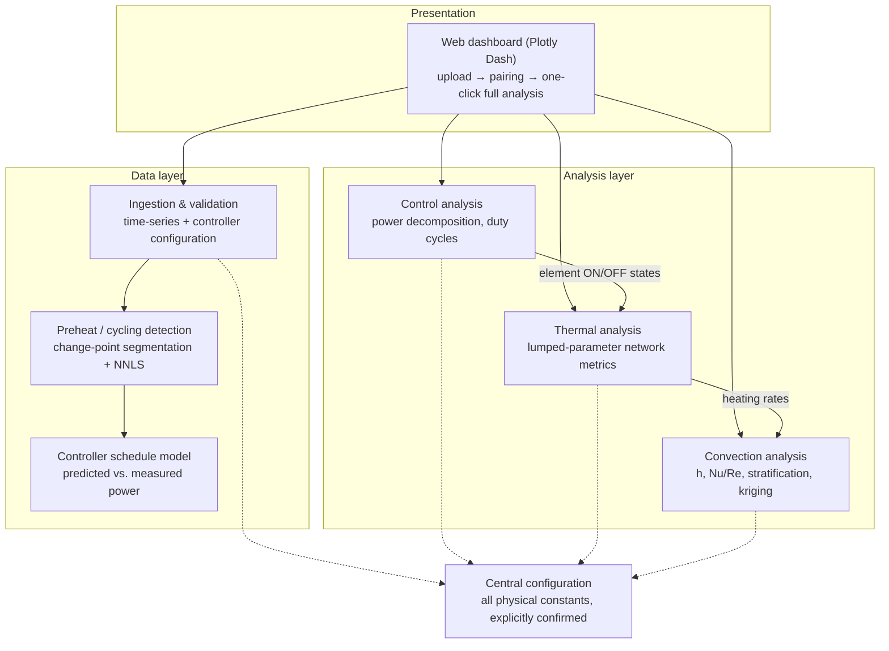

# Temperature Modeling — Thermal & Airflow Characterization of a Convection Oven Cavity

**A data-driven engineering analysis system that reconstructs heating-element
behavior, thermal response, and airflow characteristics of a convection oven
cavity  — thermocouple arrays.**

> **Note on scope.** This repository is a *technical overview* of the system:
> its architecture, analysis methodology, and engineering practices. The
> implementation, product-specific parameters, and laboratory measurement data
> are proprietary and are intentionally **not** published here. Everything in
> this document is described at the level of standard, engineering
> methods.

---

## 1. Problem statement

Convection ovens distribute heat through an interaction of heating elements,
a circulation fan, and a baffle that shapes the airflow. Evaluating a baffle
or control-strategy design change traditionally requires either full CFD
simulation (expensive, slow to iterate) or subjective bake tests
(low resolution, poor traceability).

This system takes a third path: **instrumented empty-cavity test runs** — a
spatial array of air-temperature thermocouples, an instantaneous power meter,
and logged controller output — are transformed into quantitative,
physics-based metrics that:

- reconstruct *which heating elements were active, when, and at what duty*,
  purely from the stacked power signal;
- quantify *heat distribution quality* (uniformity, stratification,
  element-to-location coupling).

## 2. System capabilities

The production front-end is a multi-tab analytical dashboard. Each tab is
backed by a framework-agnostic analysis module:

| Capability | Description |
|---|---|
| **Run overview**     | KPI summary, preheat detection, temperature/power traces for each uploaded run |
| **Preheat analysis** | Unsupervised segmentation of the element-cycling pattern during heat-up; per-element effective wattage identification |
| **Control analysis** | Decomposition of the measured power signal into per-element ON/OFF states, duty cycles, and energy contribution shares |
| **Thermal analysis** | Heating rates per sensor location, temperature-uniformity index, element→location coupling, time constants, overshoot/settling, energy balance |
| **Convection analysis** | Heat-transfer-coefficient estimates, thermal stratification, buoyancy indicators, air-change rate, 3D temperature-field reconstruction, fan-speed effect prediction, fan-reversal characterization |
| **Run comparison** | Side-by-side comparison of design revisions across all metrics |
| **Configuration audit** | Parsed controller configuration with setpoint-indexed lookup tables, so every analysis input is visible and traceable |

## 3. Architecture

The system separates a thin presentation layer from a pure, reusable
engineering core. All mathematics operates on plain DataFrames and typed
result objects, so the same core can serve the web dashboard, notebooks, or a
CFD post-processing pipeline.

**Design principles**

- **Framework-agnostic core.** The front-end only *calls* the engineering
  modules; no analysis logic lives in UI code.
- **No hidden assumptions.** Every physical constant lives in a single
  configuration module behind explicit confirmation flags; every controller
  parameter is read from the uploaded configuration or detected from data —
  never guessed.
- **Traceability.** Every computed quantity carries its inputs, the equation
  used, its assumptions, and structured warnings. Unverified assumptions
  surface in the UI as engineering questions instead of being silently
  absorbed into results.
- **Locked file inventory.** The module set is fixed and governed by a rules
  document; new analysis extends existing modules. This keeps a
  safety-relevant analysis tool reviewable.

## 4. Analysis methodology (overview)

All methods below are standard engineering techniques; they are listed to
document *how* the system reasons, not to disclose product specifics.

### 4.1 Preheat detection

During heat-up the controller saturates its output at maximum. The preheat
instant is detected as the sharp desaturation of the logged PID output when
the cavity enters the setpoint band — a signal-derived event, not a
threshold guess. The setpoint itself is read from the logged compensated
setpoint channel.

### 4.2 Element identification — change-point segmentation + NNLS

Because multiple elements switch within one control period and the logger
samples faster than the switching, the measured power appears as *stacked
discrete levels*. The pipeline:

1. **Change-point detection** splits the power signal into plateaus.
2. **Level clustering** groups plateau means into discrete power levels.
3. **Non-negative least squares** expresses each level as a non-negative
   combination of candidate element states, yielding *effective* per-element
   wattages — which naturally deviate from nameplate ratings with line
   voltage (V²/R) and element temperature.

### 4.3 Controller schedule model

A duty-cycle control law maps the logged PID output and per-element power
factors onto predicted per-period element ON-times, per-period energy, and a
sample-rate predicted power signal. Overlaying prediction against the
measured power trace validates (or falsifies) the controller model for every
run — a built-in regression test for the system's own assumptions.

### 4.4 Power decomposition & duty cycles

Each power sample is classified to the nearest feasible element combination
within a tolerance band (unclassifiable samples are flagged and reported as a
quality metric, never dropped silently). Aggregation per control period
yields duty cycles and percentage energy shares per element.

### 4.5 Lumped-parameter thermal analysis

Each thermocouple location is treated as a thermal node
(`m·cp·dT/dt = Q_in − Q_loss`):

- **Heating rates** per location (finite difference).
- **Temperature Uniformity Index** — instantaneous spread `max(Tᵢ) − min(Tᵢ)`
  and standard deviation across the array; the primary heat-distribution
  figure of merit.
- **Element→location coupling** — correlation of local heating rate with
  per-element duty, quantifying how much each element drives each region of
  the cavity (a direct baffle-effectiveness signal).
- **Dynamics** — first-order time constants, overshoot and settling around
  the setpoint, and an electrical-in vs. thermal-stored/lost energy balance.

## 5. Technology stack

| Layer | Technology |
|---|---|
| Numerics & data | Python 3.11+, NumPy, pandas, SciPy (signal, optimize/NNLS) |
| Machine learning | scikit-learn (Gaussian-process regression for field kriging) |
| Visualization | Plotly |
| Front-end | Dash + dash-bootstrap-components (multi-tab analytical dashboard, in-browser 3-step upload/pairing workflow) |
| Serving | WSGI — waitress (Windows) / gunicorn (Linux) / container |

## 6. Engineering practices

- **Three-gate validation** before any change is accepted: syntax parse →
  clean import → full end-to-end execution against a reference dataset with
  every dashboard tab populated.
- **Single source of truth** for constants and column mappings, with explicit
  per-item confirmation flags.
- **Structured warnings & questions** generated by each analysis module, so
  the tool communicates the limits of its own conclusions.
- **Stateless analysis** — uploads are processed per request; horizontal
  scaling is trivial.

## 7. What is intentionally *not* in this repository

- Application and analysis **source code**.
- **Product parameters** — element ratings, cavity geometry, sensor
  positions, controller gains/configuration, fan specifications.
- **Measurement data** — all laboratory test runs and derived datasets.
- Product imagery and internal design documentation.

If you are interested in the methods or architecture, the descriptions above
are complete at the conceptual level and reference only standard engineering
techniques.

## 8. License

The documentation in this repository is released under the [MIT License](LICENSE).
It contains no proprietary information.
