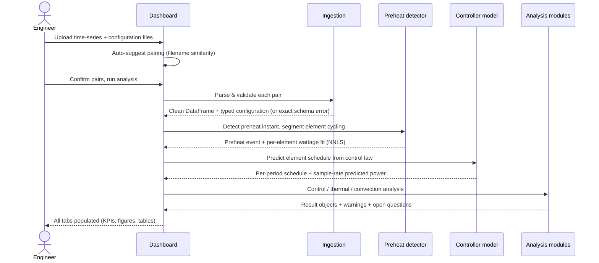

# Analysis pipeline — run lifecycle

This document walks through what happens between "engineer drops two files
into the browser" and "seven fully populated analysis tabs". It complements
the [README](../README.md) architecture overview. All descriptions are
generic; no product-specific values are included.

## 1. Inputs

Each experimental run is a pair of files:

1. **Time-series log** — a sampled record of the run containing a timebase,
   instantaneous electrical power, the controller's PID output, the
   compensated setpoint, and the spatial thermocouple array (center,
   walls, ceiling, floor and corner positions). Sensor channels are resolved
   through an alias table, so minor naming drift between lab exports does not
   break ingestion.
2. **Controller configuration export** — a key-value record of the
   controller parameterization active during the run: per-element power
   factors across control phases, PID gains, fan speeds, the control period,
   and setpoint-indexed lookup tables (resolved by exact match or
   interpolation at analysis time).

There are **no hardcoded data paths** — files enter exclusively through the
in-browser upload workflow, and filename similarity auto-suggests
time-series ↔ configuration pairing, which the engineer can override.

## 2. Run lifecycle

## 3. Stage detail

### Ingestion & validation

Parsing is strict: required channels are checked up front and a missing
column produces an exact, user-facing error rather than a downstream
exception. Sensor artifacts are cleaned before analysis. The configuration
export is normalized into a typed object; setpoint-dependent parameters are
resolved for the run's actual setpoint.

### Preheat & cycling detection

The preheat instant is derived from the controller's own behavior (PID
output desaturation), making it robust across setpoints and revisions. The
pre-preheat power signal is segmented by change points rather than assuming
a fixed cycling schedule, because real controllers do not cycle with perfect
periodicity.

### Controller model validation

The predicted power signal from the duty-cycle control law is overlaid on
the measured power trace in the dashboard. This is deliberate
self-verification: if prediction and measurement diverge, the run is flagged
before any downstream metric is trusted.

### Analysis modules

Each module returns an immutable result object that carries, alongside the
numbers:

- the **inputs** used (columns, time windows, smoothing parameters),
- the **equations** applied, with variable definitions,
- **warnings** — structured, machine-generated flags for anything that
  weakens a conclusion (high unclassified-sample fraction, Biot-number
  validity limits, short steady-state windows, …),
- **open questions** — parameters the analysis would need confirmed to
  tighten its uncertainty. These render directly in the UI.

This pattern makes the tool honest: an engineer always sees *why* a number
is what it is and what would invalidate it.

### Multi-run comparison

Because every run reduces to the same typed result objects, revision
comparison (e.g. baffle design A vs. B at the same setpoint) is a direct
metric-by-metric alignment — uniformity, stratification, coupling
coefficients, duty cycles, settling behavior — rather than a subjective
reading of overlaid curves.

## 4. Quality gates

The project enforces a three-gate validation for every change:

1. **Syntax** — AST parse of every module.
2. **Import** — every module imports cleanly in a fresh interpreter.
3. **Functional** — the full pipeline executes end-to-end against a
   reference dataset and populates every tab.

Combined with the locked module inventory and the single source of truth for
constants, the analysis codebase stays small, reviewable, and reproducible.
